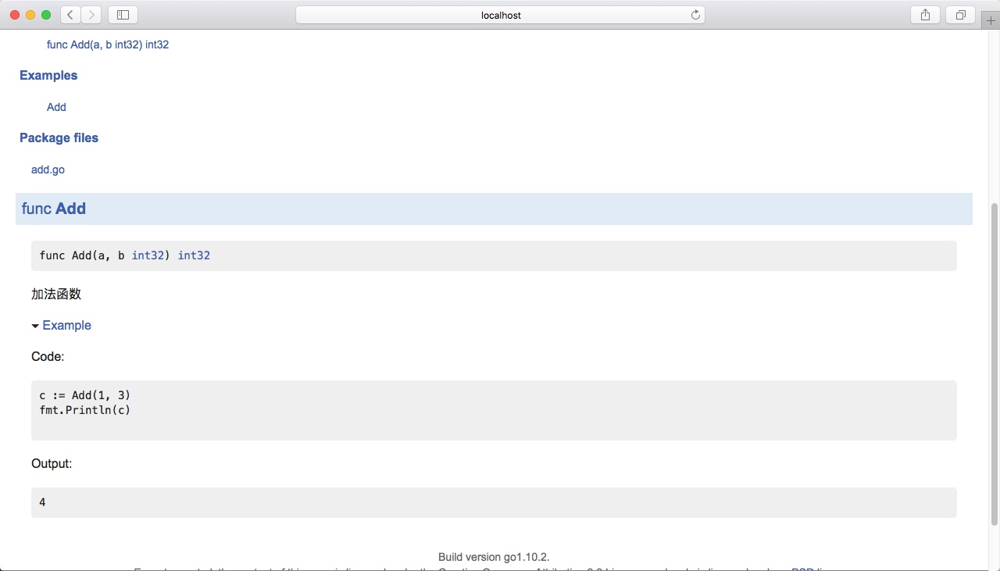

## 0. 前言

A bite of GoLang（浅尝GoLang），本文只是Go语言的冰山一角，本文包含作者学习Go语言期间积累的一些小的经验，同时为了方便让读者了解到Go语言中的一些概念，文中包含了许多快速简洁的例子，读者后期可以去自行拓展。当然写这篇文章的灵感来源于GitHub上的 a bite of Python

## 1. 基础

### 1.0、环境搭建

#### 1、下载安装包安装

通过浏览器访问下面的地址 https://golang.org/dl/ 要是自己的网络不能翻墙的话，可以访问下面的Go语言中文网 https://studygolang.com/dl 下载指定的版本的安装包直接下一步就可以安装完成；

#### 2、命令行安装

Mac 利器 home brew 安装 go

```
brew update && brew upgrade
brew install git
brew install mercurial
brew install go
```

安装完成之后

```
vim ~/.bashrc
```

```
#GOROOT
export GOROOT=/usr/local/Cellar/go/1.7.4/libexec

#GOPATH
export GOPATH=$HOME/GoLangProject

#GOPATH bin
export PATH=$PATH:$GOPATH/bin

#GOPATH root bin
export PATH=$PATH:$GOROOT/bin
```

```
source ~/.bashrc
```

OK配合完成之后,输入go env验证一下是否配置成功

```
~ sheng$ go env
GOARCH="amd64"
GOBIN=""
GOEXE=""
GOHOSTARCH="amd64"
GOHOSTOS="darwin"
GOOS="darwin"
GOPATH="/Users/verton/GoLangProject"
GORACE=""
GOROOT="/usr/local/Cellar/go/1.7.4/libexec"
GOTOOLDIR="/usr/local/Cellar/go/1.7.4/libexec/pkg/tool/darwin_amd64"
CC="clang"
GOGCCFLAGS="-fPIC -m64 -pthread -fno-caret-diagnostics -Qunused-arguments -fmessage-length=0 -fdebug-prefix-map=/var/folders/z2/h48yrw8131g824_bvtw6584r0000gn/T/go-build415367881=/tmp/go-build -gno-record-gcc-switches -fno-common"
CXX="clang++"
CGO_ENABLED="1"
```

### 1.1、变量定义

#### 1、通过var关键字

```
var a int
var b string
```

在Go语言中在定义变量的时候，是变量在前类型在后，现在你暂时先不用考虑那么多为什么，就先知道Go是这样的定义形式就可以了；当然可以多个变量一起定义,同时可以一起赋初值

```
var a,b,c bool
var m,n string = "Hello","World"
var (
    aa = 1
    bb = "hello world"
    cc = true
)
```

当然也可以让编译器自动决定类型，比如

```
var s,m,p,q = 1,"hahah",false,"xixiix"
```

#### 2、使用 := 定义变量

```
s,m,p,q := 1,"hahah",false,"xixiix"
```

这样呢可以让代码写的更加简短一点，当然呢 := 只能在函数内使用，是不能在函数外使用的。（相关的函数的知识后面会做介绍）

### 1.2、内建变量类型

#### 1、bool 、string

这两个类型就不做过多的介绍，因为基本每一门语言里面都有这两个类型，在Go语言里面也是一样的

#### 2、(u)int、(u)int8、(u)int16、(u)int32、(u)int64、uintptr

上面这些就是Go的整数类型，加u和不加u的区别就是有无符号的区别，Go语言中的整数类型还分为两个大类，一个是规定长度的，比如：int8、int16、int32...，还有一种就是不规定长度的，它是根据操作系统来，在32位系统就是32位，在64位系统就是64位的，Go语言中没有int、long 这些类型，你想要定义一个相对较长的定义int64就可以了，最后uintptr就是Go语言的指针，后面我会再来介绍它

#### 3、byte、rune

byte就不用过多介绍了，大家都知道字节类型，那rune是什么呢，这就是Go语言的“char”，因为char只有一个字节在使用中会有很多的坑，Go语言针对这点痛点做了一些优化

#### 4、float32、float64、complex64、complex128

前面两个不过多介绍，浮点数类型32位和64位的，后面两个是一个复数的类型，complex64实部和虚部都是32位的，complex128实部和虚部都是64位的

### 1.3、常量与枚举

```
const a = 1
const b,c = 2,3
const (
    d = 5
    e,f = 6,7
)
```

常量数值可以作为各种类型使用,比如以下代码

```
var s,p = 3,4
m := math.Sqrt(s*s + p*p)
fmt.Println(m)
```

这段代码语法是编译不通过的，因为Sqrt的参数必须是一个浮点数类型；但是呢我们把是s、p定义成常量就可以编译通过了

```
const s,p = 3,4
m := math.Sqrt(s*s + p*p)
fmt.Println(m)
```

Go语言中的枚举类型就是通过const来实现，同时Go语言中还可以通过iota实现自增的功能

```
func enums(){

	const (
		a = iota
		b
		c
	)
	fmt.Println(a, b, c)
}
```

调用上面这个函数显而易见，会输出

```
0 1 2
```

### 1.4、条件语句

#### 1、if

正常的条件判断我这边就不做过多的介绍，当然Go语言有它特别的地方，if的条件里可以赋值，比如：

举个读文件的例子，ioutil.ReadFile 这个方法有两个返回值，后面会详细的讲解，常规的写法是

```
const filename  = "file.txt"
content,err := ioutil.ReadFile(filename)
if err != nil {
	fmt.Println(err)
}else {
	fmt.Println(string(content))
}
```

Go语言可以整合成下面的写法

```
const filename  = "file.txt"
if content,err := ioutil.ReadFile(filename); err != nil {
	fmt.Println(err)
}else {
	fmt.Println(string(content))
}
```

#### 2、switch

```
func eval(a int, b int, op string) int {

	var result int
	switch op {

		case "+":
			result = a + b
		case "-":
			result = a - b
		case "*":
			result = a * b
		case "/":
			result = a / b
		default:
			panic("unsupported op")
	}
	return result
}
```

看上面的这段代码，你发现和别的语言不一样的地方是怎么没有break，是的，Go语言中switch会自动break，除非使用fallthrough

同时，Go语言的switch还有另外一种写法，结合一个最常见的Switch用法举个例子吧，比如通过考试分数判断是否合格

```
func grade(score int) string {

	switch {
		case score > 100 || score < 0:
			panic("Wrong score")
		case score > 80:
			return "A"
		case score > 70:
			return "B"
		case score > 60:
			return "C"
		default:
			return "D"
	}
}
```

上面的一个写法可以发现switch后面是可以没有表达式的

### 1.5、循环

#### 1、for

for关键字和其他语言有着共同的功能，同时还充当的Go语言中的 while 功能，Go语言中没有 while 关键字

```
for scanner.Scan() {
	fmt.Println(scanner.Text())
}
```

上面的循环代码省略了起始条件，省略了递增条件，就跟while的功能非常的类似

```
for {
    fmt.Println("hello world")
}
```

上面其实就是一个死循环，因为Go语言中经常会用到，后面的并发编程 Goroutine 的时候还会给大家继续介绍。

### 1.6、函数

#### 1、普通函数

普通的函数定义我这边不再过多阐述，跟变量定义类似，函数名在前，函数返回类型在后

#### 2、多返回值

这个是Go语言的不一样的地方，函数可以有多个返回值，比如 ioutil.ReadFile 这个函数就是有两个返回值，但是呢多返回值不要滥用，尽量贴合Go语言的风格，常规返回值和一个error，那我门这边可以将上面的加减乘除的例子做一下改造，因为panic之后程序就会终止了，我们可以将错误信息直接返回出来，让程序继续执行

```
func eval(a int, b int, op string) (int, error) {

	switch op {

		case "+":
			return a + b, nil
		case "-":
			return a - b, nil
		case "*":
			return a * b, nil
		case "/":
			return a / b, nil
		default:
			return 0, fmt.Errorf("unsupported op")
	}
}
```

#### 3、函数可作为参数

```
func apply(op func(int, int) int, a, b int) int {
	return op(a, b)
}
```

Go语言定义这种函数在前，参数在后的复合函数非常的方便，只需要apply一个函数就可以了，当然在现实的过程中有时候也会了偷下懒，相关的op函数就直接写成一个匿名函数了

```
fmt.Println("sub(3, 4) is:", apply(
	func(a int, b int) int {
		return a - b
	}, 3, 4))
```

这样也是OK的

#### 4、没有默认参数、没有可选参数

Go语言中没有其他语言类似Lambda这种很花哨的用法，除了一个可变参数列表

```
func sum(numbers ...int) int {
	s := 0
	for i := range numbers {
		s += numbers[i]
	}
	return s
}
```

上面就是一个参数求和函数

### 1.7、指针

#### 1、指针不能运算

比如想对指针做加1运算，Go语言是不支持的；当然要是想在函数内部改变函数外面的变量的值，通过指针是如何实现的呢，如下图所示


#### 2、Go语言只有值传递

Go语言中想要改变变量的值，只能传一个指针进去，比如常见 a b 两个变量的值交换

```
func swap(a, b int) {
    *a, *b = *b, *a
}
```

当然呢，交换参数值是不建议上面的写法的

## 2. 内建容器

### 2.0、数组

#### 1、定义

```
var arr1 [5]int
arr2 := [3]int{1, 3, 5}
arr3 := [...]int{2, 4, 6, 8, 10}
var grid [4][5]int
```

数组的定义和变量的定义类似，数组名在前类型在后；
常规的遍历操作也是类似

```
for i, v := range arr {
	fmt.Println(i, v)
}
```

i 是数组的下标，v是数组的值

#### 2、数组是值类型

和上面值传递的概念类似，通过传参在函数内部是改变不了数组的值的;当然要是想改变相关的数组的值，可以通过指针来改变的。接下来的Slice可以直接解决上述的问题。

### 2.1、Slice(切片)的概念

#### 1、Slice定义
Slice是什么呢？其实呢就是数组的一个View（视图），先来段代码热个身

```
arr := [...]int{0, 1, 2, 3, 4, 5, 6, 7}

fmt.Println("arr[2:6] =", arr[2:6])
fmt.Println("arr[:6] =", arr[:6])
```

结果输出：

```
arr[2:6] = [2 3 4 5]
arr[:6] = [0 1 2 3 4 5]
```

从上面的输出结果可以直接的看出，arr加一个下标区间都叫做Slice，Slice的区间是一个左闭右开的区间
当然我们还需要知道一个概念，Slice是没有数据的，是对底层Array的一个View，如何理解这个概念呢？简单的用一个例子来理解它

```
package main

import "fmt"

func updateSliceData(s []int) {
	s[0] = 666
}

func main() {
	arr := [...]int{0, 1, 2, 3, 4, 5, 6, 7}

	s1 := arr[2:]
	fmt.Println("s1 =", s1)
	s2 := arr[:]
	fmt.Println("s2 =", s2)

	fmt.Println("更新Slice数据 s1")
	updateSliceData(s1)
	fmt.Println(s1)
	fmt.Println(arr)

	fmt.Println("更新Slice数据 s2")
	updateSliceData(s2)
	fmt.Println(s2)
	fmt.Println(arr)
}
```

结果输出为：

```
s1 = [2 3 4 5 6 7]
s2 = [0 1 2 3 4 5 6 7]
更新Slice数据 s1
[666 3 4 5 6 7]
[0 1 666 3 4 5 6 7]
更新Slice数据 s2
[666 1 666 3 4 5 6 7]
[666 1 666 3 4 5 6 7]
```

#### 2、ReSlice

就是在一个Slice上进一步slice，比如

```
arr := [...]int{0, 1, 2, 3, 4, 5, 6, 7}
ss := arr[:6]
ss = ss[:5]
ss = ss[2:]
```

结果输出：

```
[0 1 2 3 4]
[2 3 4]
```

#### 3、Slice拓展

首先我们先看一个例子

```
arr := [...]int{0, 1, 2, 3, 4, 5, 6, 7}
s1 := arr[2:6]
s2 := s1[3:5]
```

大家或许会有疑问，这个s2不会报错么，要是不报错结果又是多少呢？

```
[2 3 4 5]
[5 6]
```

答案是可以，上述就是s1、s2的值，是不是跟你想的有点不一样。那么这又是为什么呢？


这就是为什么能把 6 这个值取出来的原因，因为slice是array的底层的一个view，是不是依然还是有点懵，具体又是如何实现的呢？

#### 4、Slice实现


从上图是不是大体明白为什么上面那个例子能把6取出来了；看到这里大家也能大体明白Slice内部的ptr、len、cap是什么意思，ptr指向slice的开头的元素，len是slice的长度，cap代表底层的array从ptr开始到结束的长度，Slice是可以向后扩展的，但是不能向前扩展，所以只要不超过cap的长度slice都是可以扩展的，但是常规的s[i]取值是不可以超过len的。
用一个例子来简单的理解一下

```
arr := [...]int{0, 1, 2, 3, 4, 5, 6, 7}
s1 := arr[2:6]
fmt.Printf("len(s1): %d   ; cap(s1): %d ", len(s1), cap(s1))
```

输出结果：

```
len(s1): 4   ; cap(s1): 6
```

### 2.2、Slice(切片)的操作

#### 1、向Slice添加元素

```
s3 := append(s2, 8)
s4 := append(s3, 9)
s5 := append(s4, 10)
fmt.Println("s3, s4, s5 =", s3, s4, s5)
fmt.Println("arr =", arr)
```

上面的这个例子打印出来结果又是多少呢？

```
s3, s4, s5 = [5 6 8] [5 6 8 9] [5 6 8 9 10]
arr = [0 1 2 3 4 5 6 8]
```

上面的9 ，10为什么不见了呢？因为Go语言在append数据超过cap长度的时候会分配一个更长的数组，如果arr不再使用的话就会被垃圾回收掉。
在append的过程中，由于是值传递的关系，len、cap都有可能会改变，所以呢必须要用一个新的slice来接收这个slice，通常会写成

```
s = append(s, value1)
```

#### 2、创建slice

当然slice也可以直接通过var关键字创建

```
var s []int
```

这样创建的slice的初始值就是nil，别的语言中的null的意思，当然也是可以赋初值的，比如：

```
s1 := []int{2, 4, 6, 8}
```

就上面的Zero Value的Slice的情况，要是我这个时候对这个slice进行append操作会怎么样呢？这个slice的内部的len以及cap又是如何变化的呢？

```
var s []int
for i := 0; i < 100; i++ {
	fmt.Printf("%v, len = %d, cap = %d\n", s, len(s), cap(s))
	s = append(s, 2*i+1)
}
```

结果我就不输出了，因为相对太长，我把相应的结果总结一下，就是len就是一个步长为1由1增至100，cap呢？当系统发现不够存储的时候会分配一个现有长度两倍的空间。

当然在实际生产过程中，大多是使用的make关键字来创建slice的

```
s2 := make([]int, 4)
s3 := make([]int, 8, 16)
```

#### 3、Copy Slice数据

```
func Copy(dst Writer, src Reader) (written int64, err error)
```

文档中可以看的很清晰，直接将第二个参数直接拷贝进第一个参数

```
s1 := []int{2, 4, 6, 8}
s2 := make([]int, 16)
copy(s2, s1)
fmt.Println(s2)
```

结果输出

```
[2 4 6 8 0 0 0 0 0 0 0 0 0 0 0 0]
```

#### 4、Slice删除元素

```
s1 := []int{2, 4, 6, 8}
s2 := make([]int, 16)
copy(s2, s1)
```

比如我要删除 s2 中的第 3 个元素该如何操作呢？

```
s2 = append(s2[:2], s2[3:]...)
```

当然现实的使用中还会从slice中pop一个值出来，下面分别演示一下从s2头部pop和从s2尾部pop数据

```
front := s2[0]
s2 = s2[1:]
```

```
tail := s2[len(s2)-1]
s2 = s2[:len(s2)-1]
```

### 2.3、Map

#### 1、创建map

```
var m1 map[string]int
m2 := make(map[string]int)
```

上述就是常见的创建map的方式，但是m1、m2还是有区别的，m1是nil，m2是一个空map;常规的遍历map也是用 range 的方式就可以，

```
for k, v := range m {
	fmt.Println(k, v)
}
```

当然细心的会发现，在遍历的过程中是不能保证顺序的，当然要是想顺序遍历，需要自己手动对key进行排序，可以将key存进slice，然后再通过slice遍历相关的key获取map的值。

#### 2、获取map元素

m[key] 一般就是这样获取map的值

```
var map1 = map[string]string{

	"name" : "shengguocun",
	"gender" : "male",
	"city" : "hangzhou",
}

value1 := map1["age"]
fmt.Println(value1)
```

先来猜测一下，上述这段代码可以运行么？会不会报错？

答案是不会，这就是Go语言和别的语言不一样的地方，上述的例子中 value1 的值是一个空字符串，map中当key不存在时，会获取value类型的初始值。

```
gender, ok := map1["gender"]

if ok {
	fmt.Println("Gender 的值为 : ", gender)
}else {
	fmt.Println("Key 不存在")
}
```

既然Go语言的出现就是为了解决别的语言的痛点，所以在使用过程中不再需要每次获取某个 key 的时候都要去 isset 判断一下，Go的获取map的值的时候第二个返回值就是别的语言 isset 的功能；存在返回 true ，不存在返回 false。

#### 3、删除元素

delete函数，就可以直接删除指定的key的值


这是Go语言的官方文档，不难理解比如要删除上面的 map1 的 city 的值

```
delete(map1, "city")
```

直接调用就可以

#### 4、map的key

为什么要把key单独拿出来说呢？因为map底层使用的是hash表，所以map的key必须可以比较相等；换句话说就是除了 slice、map、function的内建类型都可以作为key。

### 2.4、字符和字符串处理

#### 1、rune介绍

rune就是Go语言的字符串类型，其实可以理解为是 int32 的一个別名，下面我们通过例子来深入理解一下rune

```
s1 := "你好,杭州"
fmt.Println(s1)

for _, ch := range []byte(s1) {

	fmt.Printf("%X ", ch)
}

fmt.Println()

for i, ch := range s1 {

	fmt.Printf("(%d %X) ", i, ch)
}
```

输出结果

```
你好,杭州
E4 BD A0 E5 A5 BD 2C E6 9D AD E5 B7 9E
(0 4F60) (3 597D) (6 2C) (7 676D) (10 5DDE)
```

从上述的例子我们可以直接的看出来，其实就是将UTF-8编码解码，然后再转成Unicode之后将它存放进一个rune（int32）中

#### 2、字符串处理

UTF-8编码的rune长度统计

```
count := utf8.RuneCountInString(s1)
fmt.Println("Rune Count :", count)
```

输出结果为：

```
Rune Count : 5
```

字符串的输出操作

```
bytes := []byte(s1)
for len(bytes) > 0 {
	ch, size := utf8.DecodeRune(bytes)
	bytes = bytes[size:]
	fmt.Printf("%c ", ch)
}
```

用rune实现上述同样的功能

```
for _, ch := range []rune(s1) {
	fmt.Printf("%c ", ch)
}
```

## 3. 面向“对象”

### 3.0、结构体和方法

#### 1、结构体的创建

go语言仅支持封装，不支持继承和多态；这句话怎么理解呢？就是说在Go语言内部没有class，只有struct；也没有复杂的继承和多态，那继承和多态的任务又是通过什么实现的呢？Go是面向接口编程，可以通过接口来实现继承和多态的相关的任务，后面我会再进行介绍。
下面先来介绍一下struct的创建：

```
type Node struct {
	Value       int
	Left, Right *Node
}
```

通过type、struct关键字创建结构体类型，当然在创建了结构体类型之后，就可以创建相关类型的变量

```
var root tree.Node
root = tree.Node{Value:1}
root.Value = 2
root.Left = &tree.Node{Value:3}
root.Right = &tree.Node{}
```

#### 2、方法创建

结构体的方法的创建和普通的函数创建没有太大的区别，只是在方法名前面添加一个接收者，就相当于其他语言的this

```
func (node Node) Print() {
	fmt.Print(node.Value, " ")
}
```

上述就是一个值接收者打印出Node的Value的值的方法。
当然要是需要改变Value的值的时候，就需要一个指针接收者。

```
func (node *Node) SetValue(value int) {
	node.Value = value
}
```

有一个疑问，要是对一个值为nil的Node进行 SetValue 操作会发生什么？

```
var pRoot *tree.Node
pRoot.SetValue(1)
```

虽说nil指针可以调用方法，但是下面的Value是拿不到，自然就会报下面的错了

```
panic: runtime error: invalid memory address or nil pointer dereference
[signal SIGSEGV: segmentation violation code=0x1 addr=0x0 pc=0x20c3]

goroutine 1 [running]:
panic(0x8f100, 0xc42000a070)
```

实际使用过程中可以添加相关的判断在做处理。结合上面的知识我们不难写出一个树的遍历的方法的代码

```
func (node *Node) Traverse()  {

	if node == nil {
		return
	}
	node.Print()
	node.Left.Traverse()
	node.Right.Traverse()
}
```

### 3.1、包和封装

#### 1、命名规范

* 名字一般使用 CamelCase（驼峰式）
* 首字母大写：Public
* 首字母小写：Private

#### 2、包的概念

* 每个目录一个包，但是包名和目录名不一定要一样的，但是每个目录只能包含一个包；
* main包是一个相对特殊的，main包包含一个可执行入口；
* 为结构体定义的方法必须放在同一个包内

当然上面的例子已经在不经意间提前引入了package的概念

### 3.2、扩展已有类型

在面向对象中，我们想要扩展一下别人的类，我们通常继承一下就好了，但是Go语言中没有继承的概念，我们该如何处理呢？

#### 1、定义别名（1.9新特性）

在大规模的重构项目代码的时候，尤其是将一个类型从一个包移动到另一个包中的时候，有些代码使用新包中的类型，有些代码使用旧包中的类型

基本语法就是：

```
type identifier = Type
```

比如内建的byte类型，其实是uint8的类型别名，而rune其实是int32的类型别名。

```
// byte is an alias for uint8 and is equivalent to uint8 in all ways. It is
// used, by convention, to distinguish byte values from 8-bit unsigned
// integer values.
type byte = uint8

// rune is an alias for int32 and is equivalent to int32 in all ways. It is
// used, by convention, to distinguish character values from integer values.
type rune = int32
```

通过别名的方式就可以拓展了，比如

```
type T1 struct{}
type T3 = T1
func (t1 T1) say(){}
func (t3 *T3) greeting(){}
func main() {
	var t1 T1
	// var t2 T2
	var t3 T3
	t1.say()
	t1.greeting()
	t3.say()
	t3.greeting()
}
```

当然要是T1也定义了 greeting 的方法，那么编译会报错的，因为有重复的方法定义。

#### 2、使用组合

比如我们想扩展上面的树的包，实现一个自己的中序遍历，该如何实现呢？通过代码来理解一下使用组合的概念

```
type myNode struct {
	node *tree.Node
}

func (myNodeNode *myNode) Traverse() {

	if myNodeNode == nil || myNodeNode.node == nil {
		return
	}
	left := myNode{myNodeNode.node.Left}
	right := myNode{myNodeNode.node.Right}
	left.ownFunc()
	myNodeNode.node.Print()
	right.ownFunc()
}
```

### 3.3、GOPATH以及目录结构

* 默认在 ～／go 目录下（unix或者Linux环境），%USERPROFILE%\go 目录下（windows环境）
* 官方推荐：所有的项目和第三方库都放在同一个GOPATH下
* 当然也可以将每个项目放在不同的GOPATH下

如何查看自己的GOPATH呢？

```
~ sheng$ echo $GOPATH
/Users/verton/GoLangProject
```

#### 1、go get获取第三方库

```
go get url
```

这样是可以获取GitHub上面的三方的库，但是Golang.org上面要是不能翻墙是获取不了的，这里我给大家介绍一个新的工具 **gopm**

```
sheng$ go get github.com/gpmgo/gopm
```

一行命令就可以装好了，这个时候再get三方的库就毫无压力了，因为这个国内有相关的镜像

```
gopm get -g url
```

采用-g 参数，可以把依赖包下载到GOPATH目录中

#### 2、目录结构

* src
    * git repo 1
    * git repo 2
* pkg
    * git repo 1
    * git repo 2
* bin
    * 执行文件 1 2

从上述的目录结构上我们可以看出来，src pkg 是对应的，src 是我们的代码的位置以及三方库的位置，pkg 是build的中间过程，可以暂时先不用关注，bin下面就是可执行文件。

## 4. 面向接口

### 4.0、Duck Typing的概念

很多语言都有duck typing的概念， 用一个简单的例子来描述一下这个概念


大黄鸭是鸭子么？这个答案是要看基于什么角度来看，从生物角度来看，那它当然不是鸭子，连基本的生命都没有；但是从duck typing的角度来看它就是一个鸭子，因为它外部长得像鸭子，通俗点概括一下duck typing的概念就是：描述事物的外部行为而非内部结构。

从严格意义上讲，go语言只能说是类似duck typing，go语言不是动态绑定的，go语言是编译时绑定的。

### 4.1、接口的定义和实现

在Go语言中，接口interface其实和其他语言的接口意思也没什么区别。一个结构体必须实现了一个接口的所有方法，才能被一个接口对象接受，这一点和Java语言中的接口的要求是一样的。interface理解其为一种类型的规范或者约定。

#### 1、接口的定义

```
type Retriever interface{
    Get(url string) string
}
```

这样就定义了一个接口，它包含一个Get函数。

#### 2、接口的实现

现在我们就来实现一下这个接口。比如我们做一个拉取某个页面的操作

```
package rick

import (
	"net/http"
	"net/http/httputil"
)

type Retriever struct {

}

func (r Retriever) Get(url string) string {

	resp, err := http.Get(url)
	if err != nil {
		panic(err)
	}
	result, err := httputil.DumpResponse(resp, true)
	resp.Body.Close()
	if err != nil {
		panic(err)
	}
	return  string(result)
}
```

```
package main

import (
	"shengguocun.com/retriever/rick"
	"fmt"
)

type Retriever interface{
	Get(url string) string
}

func download(r Retriever) string {
	return r.Get("http://www.shengguocun.com")
}

func main() {

	var r Retriever
	r = rick.Retriever{}
	fmt.Println(download(r))
}
```

上述rick.Retriever就实现了Retriever接口。

### 4.2、接口值的类型

#### 1、接口变量里面有什么

继续使用上面的例子

```
var r Retriever
r = rick.Retriever{}

fmt.Printf("\n %T %v \n", r, r)
```

会输出什么呢？

```
rick.Retriever {}
```

这就是常规的值传递，没有什么特别的地方。要是 Retriever 这个struct很大，我们不希望通过传值的方法去拷贝，而是通过指针访问Get方法。

```
func (r *Retriever) Get(url string) string {

	resp, err := http.Get(url)
	if err != nil {
		panic(err)
	}
	result, err := httputil.DumpResponse(resp, true)
	resp.Body.Close()
	if err != nil {
		panic(err)
	}
	return  string(result)
}
```

```
var r Retriever
r = &rick.Retriever{}

fmt.Printf("\n %T %v \n", r, r)
```

这时候的Type、Value又是什么？

```
*rick.Retriever &{}
```

我们可以看到是一个指针，所以我们一般用到接口的指针，因为它的肚子里含有一个指针，通常我们会说“**接口变量自带指针**”，那我们现在用两个图来总结一下上面的概念


概括为：接口变量里面可以是实现者的类型和实现者的值，或者是接口类型里面可以是实现者的类型和实现者的指针，同时指向实现者。

#### 2、查看接口变量

说到这里要提到一个特殊的接口，空接口 interface{} ，对于空接口 interface{} 其实和泛型的概念很像，任何类型都实现了空接口。在方法需要返回多个类型的时候，返回值的类型我们一般定义为 interface{} 。

这时我们现在引入获取接口变量肚子里的类型的另外一种写法，叫 Type Assertion（断言）。比如

```
var a interface{}
fmt.Println("Are you ok?", a.(string))
```

然而上述的写法一旦断言失败，会报出panic错误，当然这样的程序就显得十分的不友好。我们需要在断言前进行一个判断。

```
value, ok := a.(string)
if !ok {
    fmt.Println("断言失败，这不是一个string类型")
    return
}
fmt.Println("值为：", value)
```

另外我们可以结合switch进行类型判断

```
var r interface{}
r = balabalaFunction()
switch v := r.(type) {
	case bool:
		fmt.Println("type bool...")
	case int:
		fmt.Println("type int...")
}
```

Tips:转换类型的时候如果是string可以不用断言，使用fmt.Sprint()函数可以达到想要的效果。

### 4.3、接口的组合

#### 1、定义

什么叫接口的组合？当然这就是它的字面上的意思，接口可以组合其他的接口。这种方式等效于在接口中添加其他的接口的方法。在系统函数中就有很多这样的组合，比如：ReadWriter

```
// ReadWriter is the interface that groups the basic Read and Write methods.
type ReadWriter interface {
	Reader
	Writer
}
```

在常见的读写文件的时候，网络相关以及一些底层的东西经常会遇到 Reader 、Writer

#### 2、实例演示

为了更好的理解接口的组合的概念，下面用一个简单的例子来进一步了解

```
// 定义Reader接口
type Reader interface {
	read()
}
// 定义Writer接口
type Writer interface {
	write()
}
// 实现上述两个接口
type myReaderWriter struct {
}

func (mrw *myReaderWriter) read()  {
	fmt.Println("myReaderWriter read func...")
}

func (mrw *myReaderWriter) write() {
	fmt.Println("myReadWriter writer func...")
}
// 定义一个接口，组合上述两个接口
type ReaderWriterV1 interface {
	Reader
	Writer
}
// 等价于
type ReaderWriterV2 interface {
	read()
	write()
}

func main() {
	mrw := &myReaderWriter{}
	//mrw对象实现了read()方法和write()方法，因此可以赋值给ReaderWriterV1和ReaderWriterV2
	var rwv1 ReaderWriterV1 = mrw
	rwv1.read()
	rwv1.write()

	var rwv2 ReaderWriterV2 = mrw
	rwv2.write()
	rwv2.read()

	//同时，ReaderWriterV1和ReaderWriterV2两个接口对象可以相互赋值
	rwv1 = rwv2
	rwv2 = rwv1
}
```

### 4.4、常用的系统接口

#### 1、Stringer

这个就是常见的 toString 的功能，

```
// Stringer is implemented by any value that has a String method,
// which defines the ``native'' format for that value.
// The String method is used to print values passed as an operand
// to any format that accepts a string or to an unformatted printer
// such as Print.
type Stringer interface {
	String() string
}
```

Stringer接口定义在fmt包中，该接口包含String()函数。任何类型只要定义了String()函数，进行Print输出时，就可以得到定制输出。比如：

```
package main

import "fmt"

type Person struct{
	age int
	gender string
	name string
}

func (p Person) String() string {
	return fmt.Sprintf("age:%d, gender:%s, name:%s", p.age, p.gender, p.name)
}

func main() {
	var i Person = Person{
		age: 25,
		gender: "male",
		name: "sheng.guocun",
	}
	fmt.Printf("%s\n", i)
	fmt.Println(i)
	fmt.Printf("%v", i)
}
```

结果输出为：

```
age:25, gender:male, name:sheng.guocun
age:25, gender:male, name:sheng.guocun
age:25, gender:male, name:sheng.guocun
```

#### 2、Reader、Writer

Reader Writer 上面有提到过，就是常见的读写文件的时候经常会用到，就是对文件的一个抽象，但是不仅这些，比如常见的

```
// NewScanner returns a new Scanner to read from r.
// The split function defaults to ScanLines.
func NewScanner(r io.Reader) *Scanner {
	return &Scanner{
		r:            r,
		split:        ScanLines,
		maxTokenSize: MaxScanTokenSize,
	}
}
```

这的参数也是一个Reader，还有很多的底层的代码都是基于 Reader Writer 的，这里就不一一举例了。


## 5. 函数式编程

### 5.0、函数式编程

Go语言作为一个通用型语言，它对函数式编程主要体现在闭包上面。

#### 1、函数式编程 VS 函数指针

* 函数是一等公民：参数、变量、返回值都可以是函数，在别的语言中大多不是这样的，比如在C++里面只有函数指针，在Java里面我们只能调用，不能把函数传给别人。

* 高阶函数：参数可以是函数，1.6.3里面的apply函数就是一个高阶函数。

* 函数 --> 闭包：首先用个例子来了解一下闭包的用法

```
package main

import "fmt"

func adder() func(int) int {
	sum := 0
	return func(v int) int {
		sum += v
		return sum
	}
}

func main() {

	a := adder()
	for i := 0; i < 10; i ++  {
		fmt.Printf("0 + 1 + 2 + ... + %d = %d\n", i, a(i))
	}
}
```

结果输出为

```
0 + 1 + 2 + ... + 0 = 0
0 + 1 + 2 + ... + 1 = 1
0 + 1 + 2 + ... + 2 = 3
0 + 1 + 2 + ... + 3 = 6
0 + 1 + 2 + ... + 4 = 10
0 + 1 + 2 + ... + 5 = 15
0 + 1 + 2 + ... + 6 = 21
0 + 1 + 2 + ... + 7 = 28
0 + 1 + 2 + ... + 8 = 36
0 + 1 + 2 + ... + 9 = 45
```

上述的 v 就称为局部变量， sum 称为自由变量，`func(v int) int {
		sum += v
		return sum
	}` 称为函数体，整个就叫做一个闭包。用一张图来概括就是：


#### 2、“正统”函数式编程

* 不可变性：不能有状态，只有常量和函数；当然这和平常的函数不一样，连变量都没有，甚至连选择语句、循环语句都没有。

* 函数只能有一个参数

要是上面的累加想做一个稍微正统函数怎么做呢？

```
type iAdder func(int) (int, iAdder)

func adderV2(base int) iAdder {
	return func(v int) (int, iAdder) {
		return base + v, adderV2(base + v)
	}
}

func main() {

	a := adderV2(0)
	for i := 0; i < 10; i ++ {
		var s int
		s, a = a(i)
		fmt.Printf("0 + 1 + 2 + ... + %d = %d\n", i, s)
	}
}
```

当然正统的不一定是最好的，正统式的写法经常导致代码的可读性变得不是很好。

### 5.1、函数式编程实例演示

#### 1、斐波那契数列

Go语言的官方案列中，对闭包的讲解通过一个常见的例子：斐波那契数列，为了更好的理解闭包的感念，那这里我们就将这个例子再来演示一遍

```
func Fibonacci() func() int {

	a, b := 0, 1
	return func() int {
		a, b = b, a+b
		return a
	}
}
```

比如我们要打印这一串斐波那契数列，我们就需要不停的调用上面的斐波那契数列的生成器。

```
f := Fibonacci()

f() // 1
f() // 1
f() // 2
f() // 3
f() // 5
f() // 8
```

#### 2、为函数实现接口

这个斐波那契数列的调用的生成器跟文件有点像，我们可以把它包装成一个 `io.Reader` 这样就跟打印一个文件一样生成这个斐波那契数列。

首先我们先定义我们的类型 `func() int` ，就取名Generate好了

```
type Generate func() int
```

同时需要将 `Fibonacci()` 函数的类型改掉

```
func Fibonacci() Generate {

	a, b := 0, 1
	return func() int {
		a, b = b, a+b
		return a
	}
}
```

是一个类型就可以实现接口，这就是Go语言灵活的地方，下一步我们实现这个Reader接口

```
func (gen Generate) Read(p []byte) (n int, err error) {

	nextNum := gen()
	numString := fmt.Sprintf("%d \n", nextNum)

	return strings.NewReader(numString).Read(p)
}
```

这里我们会发现函数也可以实现接口，这就是Go语言的不一样的地方，因为函数是一等公民，它既可以作为参数，也可以作为接收者。首先我们要先取到下一个元素 `nextNum` ,然后将下一个元素写进 *p* 。然后我们直接用一个写好的文件打印的函数

```
func printFileContents(reader io.Reader) {
	scanner := bufio.NewScanner(reader)

	for scanner.Scan() {
		fmt.Println(scanner.Text())
	}
}
```

最后我们就可以直接调用了

```
func main() {

	f := Fibonacci()
	printFileContents(f)
}
```

当然，上述的代码是存在瑕疵的，比如这个 `printFileContents` 函数会一直读下去，就变成一个死循环了，我们需要设置其终止条件。比如上面的 *p* 太小的话，只读了一半，当然这边就留给读者后期拓展了。


## 6. 错误处理和资源管理

我们实际的代码不止 `Hello World` ,我们的代码是要运行在服务器上的，要和各种各样的用户进行交互，所以我们这里就要了解一下Go语言的资源管理和出错处理。

### 6.0、defer调用

#### 1、确保在函数结束时调用

比如一个常见的代码

```
package main

import "fmt"

func main() {

	fmt.Println(1)
	fmt.Println(2)
}
```

我要是想要让1在2后面输出该如何做呢？你说调换一下顺序呗，道理我都懂，但是我们今天要介绍的不是这个，我们只需要在打印1之前加一个 *defer* 就可以了

```
package main

import "fmt"

func main() {

	defer fmt.Println(1)
	fmt.Println(2)
}
```

要是有多个defer呢？它的输出顺序又是什么样的呢？

```
package main

import "fmt"

func main() {

	defer fmt.Println(1)
	defer fmt.Println(2)
	fmt.Println(3)
}
```

上面这段代码，输出的结果又是什么？

```
3
2
1
```

这里我们可以发现 *defer* 的调用实际是一个栈，先进后出。当然 *defer* 的最大的好处是什么呢？就是当程序中间有return返回甚至panic的时候，依然不影响 defer 后面的代码的执行。

```
package main

import "fmt"

func main() {

	defer fmt.Println(1)
	defer fmt.Println(2)
	fmt.Println(3)
	panic("whoops, something went wrong....")
	fmt.Println(4)
}
```

上述的代码在panic之后，1 2 依然能够正常输出。

#### 2、场景演示

当然说了这么多，我们在代码中常见的使用defer的场景有哪些呢？比如我们创建文件，写文件这些，过去我们用别的语言经常会在处理文件的最后释放句柄，因为中间隔了很多的文件操作，经常可能会忘记释放句柄。那Go语言就针对这样的场景做了非常好的优化，通过defer关键字实现，下面我们就通过一个简单的写文件事例来演示一下：

```
package main

import (
	"os"
	"bufio"
	"fmt"
)

func main() {

	filename := "demo.txt"
	file, err := os.Create(filename)
	if err != nil {
		panic(err)
	}
	defer file.Close()

	writer := bufio.NewWriter(file)
	defer writer.Flush()

	fmt.Fprintln(writer, "你好，杭州")
}
```


一个完整的事例就演示到这边，比如常见的 Open／Close、Lock／Unlock这些成对出现的都可以使用 *defer*

### 6.1、错误处理概念

因为在我们实际的程序中，有错直接panic中断程序执行，这时非常不友好的，通常我们会对其出错处理。比如上面的事例中 `os.Create` 函数返回的 `err` 不为 `nil` 的时候，我们需要做一个出错处理，

```
filename := "demo.txt"
file, err := os.Create(filename)
if err != nil {
	fmt.Println(err.Error())
	return
}
```

我们可以直接打印出相关的错误信息，然后直接返回。这就是常见的错误处理方式之一，当然在函数内部也可以将错误信息直接作为结果返回。

### 6.2、panic和recover

#### 1、panic

* 停止当前函数执行

panic和我们其他语言的throw exception很像

* 一直向上返回，执行每一层的defer

当然相对还是友好的，每层的defer还是会用到，一层一层的返回，返回到最后程序就会自动退出了

* 如果没有遇见recover，程序退出

#### 2、recover

* 仅在defer调用中使用

* 获取panic的值

* 如果无法处理，可充新panic

主要的特性就可以用上述几句话概括，为了更好的理解上述的概念，下面用一个简短的代码来学以致用

```
func tryDefer() {
	for i := 0; i < 100; i++ {
		defer fmt.Println(i)
		if i == 10 {
			panic("就打印到这吧")
		}
	}
}
```

上面就是一个 panic 和 defer 的结合使用，他的输出结果会是什么样的呢？

```
10
9
8
7
6
5
4
3
2
1
0
panic: 就打印到这吧

goroutine 1 [running]:
main.tryDefer()
	/Users/verton/GoLangProject/src/shengguocun.com/web/web.go:11 +0x11d
main.main()
	/Users/verton/GoLangProject/src/shengguocun.com/web/web.go:18 +0x20
```

从上述输出结果我们可以看到panic的前两个特性，那结合recover又会是什么样的呢？

```
// The recover built-in function allows a program to manage behavior of a
// panicking goroutine. Executing a call to recover inside a deferred
// function (but not any function called by it) stops the panicking sequence
// by restoring normal execution and retrieves the error value passed to the
// call of panic. If recover is called outside the deferred function it will
// not stop a panicking sequence. In this case, or when the goroutine is not
// panicking, or if the argument supplied to panic was nil, recover returns
// nil. Thus the return value from recover reports whether the goroutine is
// panicking.
func recover() interface{}
```

```
func tryRecover() {
	defer func() {
		r := recover()
		if err, ok := r.(error); ok {
			fmt.Println("错误信息: ", err)
		} else {
			panic(r)
		}
	}()

	panic(errors.New("这是一个 error"))
}
```

从上面我们可以看到 recover 是一个interface， 所以在判断的时候需要判断 r 是否是一个 error，结果自然会是输出

```
错误信息:  这是一个 error
```

那我们再用一个实际一点的例子来测试一下，比如除数为0的例子

```
func tryRecover() {
	defer func() {
		r := recover()
		if err, ok := r.(error); ok {
			fmt.Println("错误信息: ", err)
		} else {
			panic(r)
		}
	}()

	b := 0
	a := 5 / b
	fmt.Println(a)
}
```

结果输出

```
错误信息:  runtime error: integer divide by zero
```

上面的两个例子简单介绍了panic、recover的基本使用，下面通过一个稍微实际一点的例子来综合讲述一下一般的项目中是如何统一处理错误的。

### 6.3、服务器统一出错处理

现在呢我们就通过一个Http服务来展开如何统一处理服务器出错这件事，结合一个实际读取目录内文件的例子来简单介绍一下

```
func main() {

	http.HandleFunc("/list/",
		func(writer http.ResponseWriter, request *http.Request) {

		path := request.URL.Path[len("/list/"):]
		file, err := os.Open(path)
		if err != nil {
			panic(err)
		}
		defer  file.Close()

		all, err := ioutil.ReadAll(file)
		if err != nil {
			panic(err)
		}

		writer.Write(all)
	})

	err := http.ListenAndServe(":2872", nil)
	if err != nil {
		panic(err)
	}
}
```

因为在GOPATH下有一个 `demo.txt` 文件，浏览器输入一下地址 `http://localhost:2872/list/demo.txt` ,浏览器正确输出结果


万一我访问一个不存在的文件呢？会得到什么样的结果，比如我现在访问 `http://localhost:2872/list/demo.txts` GOPATH目录下没有demo.txts文件，自然你会想到会panic一个错误

```
2018/05/04 17:08:54 http: panic serving [::1]:51946: open demo.txts: no such file or directory
goroutine 5 [running]:
net/http.(*conn).serve.func1(0xc4200968c0)
	/usr/local/Cellar/go/1.10.2/libexec/src/net/http/server.go:1726 +0xd0
panic(0x124fde0, 0xc420086fc0)
	/usr/local/Cellar/go/1.10.2/libexec/src/runtime/panic.go:502 +0x229
main.main.func1(0x12d1420, 0xc42010e000, 0xc42010a000)
	/Users/verton/GoLangProject/src/shengguocun.com/web/web.go:52 +0x144
net/http.HandlerFunc.ServeHTTP(0x12aff28, 0x12d1420, 0xc42010e000, 0xc42010a000)
	/usr/local/Cellar/go/1.10.2/libexec/src/net/http/server.go:1947 +0x44
net/http.(*ServeMux).ServeHTTP(0x140b3e0, 0x12d1420, 0xc42010e000, 0xc42010a000)
	/usr/local/Cellar/go/1.10.2/libexec/src/net/http/server.go:2337 +0x130
net/http.serverHandler.ServeHTTP(0xc420089110, 0x12d1420, 0xc42010e000, 0xc42010a000)
```

从上面的部分的报错信息来看，


相关的错误信息都是 `/usr/local/Cellar/go/1.10.2/libexec/src/net/http/server.go` 的 `serve` 函数报出的，具体是哪一步报出的我就不细说了，有兴趣的可以自己按照例子自己查阅相关的源码，说到这那错误统一处理又是如何处理呢？
我们先把第一个panic替换成

```
path := request.URL.Path[len("/list/"):]
file, err := os.Open(path)
if err != nil {

	http.Error(writer, err.Error(), http.StatusInternalServerError)
	return
}
```

我们再来访问上述地址


相比之前，提示稍微友好一点了，但是这对用户来讲还是不合适的，直接将程序内部错误信息输出给用户有些欠妥。我们可以包装成一个外部的Error，首先我们先定义一个函数appHandler, 返回一个error

```
type appHandler func(writer http.ResponseWriter, request *http.Request) error
```

然后定义一个 errWrapper 函数, 返回一个handler 里面需要的函数

```
type appHandler func(writer http.ResponseWriter, request *http.Request) error

func errWrapper(handler appHandler) func(http.ResponseWriter, *http.Request) {

	return func(writer http.ResponseWriter, request *http.Request) {

		err := handler(writer, request)
		if err != nil {
			switch {

    			case os.IsNotExist(err):
    				http.Error(writer, http.StatusText(http.StatusNotFound), http.StatusNotFound)
			}
		}
	}
}
```

然后将writer和request传进handler，通过switch判断err的类型，做一个统一的返回处理；这时我们需要将原来的业务逻辑的代码稍微做一下调整，


```
http.HandleFunc("/list/",
		errWrapper(func(writer http.ResponseWriter, request *http.Request) error {
			path := request.URL.Path[len("/list/"):]
			file, err := os.Open(path)
			if err != nil {
				return err
			}
			defer  file.Close()

			all, err := ioutil.ReadAll(file)
			if err != nil {
				return err
			}

			writer.Write(all)
			return nil
		}))

err := http.ListenAndServe(":2872", nil)
if err != nil {
	panic(err)
}
```

`http.HandleFunc` 的第二个参数我们需要改为 `errWrapper` 同时将原来的函数作为参数传进去，当然这个函数为了代码的可读性应该单独抽离出来，相应的返回直接返回error就可以了，这时候我们再去访问之前的一个不存在的URL


这时候的错误就明显友好了很多，讲到这就是一个简单的统一错误处理的思路。

## 7. 测试和性能调优

### 7.0、测试

#### 1、传统测试 VS 表格驱动测试

测试的作用对于一个软件行业从业者而言都是毋庸置疑的，Go语言在测试这块它有自己独特的见解，下面我们先介绍一下这两种模式下的测试

##### 传统测试

* 测试数据和测试逻辑混在一起

* 出错信息不明确

* 一旦一个数据出错测试全部结束

下面我们简单的举个例子：

```
public function testCase(){

    assertEquals(2, add(1, 1));
    assertEquals(1, add(1, 3));
    assertEquals(0, add(1, -1));
}
```

很明显上面的几个特征它都占了，那下面我们来看一段Go语言的测试case

```
tests := []struct{
    a, b, c int32
}{
    {2, 1, 1},
    {1, 1, 3},
    {0, 1, -1},
}
for _, test := range tests {
    if act := add(test.a, test.b); act != test.c {
        // 相应的错误处理...
    }
}
```

上述就是一个典型的表格驱动测试

##### 表格驱动测试

* 分离测试数据和测试逻辑

* 明确的出错信息

* 可以部分失败

Go语言的语法使得我们更容易使用表格驱动测试的测试模式

#### 2、实例演示

说了这么多，我们通常又是如何写测试用例呢？首先下面是一段加法的代码

```
package calculator

func Add(a, b int32) int32 {

	return a + b
}
```

现在就写上面的函数的测试用例

```
package calculator

import (
	"testing"
)

func TestAdd(t *testing.T) {

	tests := []struct{
		a, b, c int32
	}{
		{1, 1, 2},
		{-1, 1, 0},
	}

	for _, test := range tests {
		if act := Add(test.a, test.b); act != test.c {

			t.Errorf("%d + %d != %d 实际为 %d", test.a, test.b, test.c, act)
		}
	}
}
```

用IDE的同学直接点击 `Run Test` 就可以了，当然也同样支持命令行运行,进入到指定的文件目录下面

```
sheng$ go test ./
ok  	shengguocun.com/functional/calculator	0.006s
```

运行相关的执行命令就可以了，要是有错误的case依然不影响相关的测试的执行，比如：

```
package calculator

import (
	"testing"
	"math"
)

func TestAdd(t *testing.T) {

	tests := []struct{
		a, b, c int32
	}{
		{1, 1, 2},
		{-1, 1, 0},
		{math.MaxInt32, 1, math.MaxInt32},
	}

	for _, test := range tests {
		if act := Add(test.a, test.b); act != test.c {

			t.Errorf("%d + %d != %d 实际为 %d", test.a, test.b, test.c, act)
		}
	}
}
```

测试用例的执行结果为

```
sheng$ go test ./
--- FAIL: TestAdd (0.00s)
	add_test.go:21: 2147483647 + 1 != 2147483647 实际为 -2147483648
FAIL
FAIL	shengguocun.com/functional/calculator	0.006s
```

我们需要将不符合预期的case做出检查，看是否是代码逻辑有问题，还是case的问题，这就是一个完整的测试用例的编写的过程。

### 7.1、代码覆盖率和性能测试

#### 1、代码覆盖率

用IDE的同学我们会发现点击 `Run Test` 按钮的时候还有一个 with coverage 的选项


```
=== RUN   TestAdd
--- PASS: TestAdd (0.00s)
PASS
coverage: 100.0% of statements

Process finished with exit code 0
```

这就是一个测试用例的代码覆盖率的结果。


IDE这块有详细的覆盖率报告，可以看到左侧的绿色就是代码的覆盖的范围，右侧有详细的每个文件的覆盖率。当然除了IDE之外命令行也是同样支持的

```
sheng$ go test -coverprofile=a.out
PASS
coverage: 100.0% of statements
ok  	shengguocun.com/functional/calculator	0.006s
```

直接查看这个 a.out 文件，似乎看得不是很明白，当然我们有一个工具叫 `go tool cover`

```
sheng$ go tool cover -html=a.out
```

运行上面的命令，就会展现一个下面的静态页面


这就是一个详细的覆盖率报告

#### 2、性能测试

对于程序员而言，代码的性能是每个人都会去关注的，Go语言在性能测试这块依然有它的独特见解 `Benchmark`

```
func BenchmarkAdd(b *testing.B) {

	aa := int32(math.MaxInt32 / 16)
	bb := int32(math.MaxInt32 / 16)
	cc := int32(math.MaxInt32 / 8) - 1

	for i := 0; i < b.N; i ++ {

		act := Add(aa, bb)
		if act != cc {

			b.Errorf("%d + %d != %d 实际为 %d",
				aa, bb, cc, act)
		}
	}
}
```

上面就是一段性能测试代码，我们不需要关注这段代码具体要跑多少次，Go语言自身会帮你决定，IDE点击 `Run Test` 完，输出相关的结果

```
goos: darwin
goarch: amd64
pkg: shengguocun.com/functional/calculator
2000000000	         0.35 ns/op
PASS

Process finished with exit code 0
```

总共跑了多少次以及每次的平均耗时，都会给出结果。当然同样支持命令行的交互方式

```
sheng$ go test -bench .
goos: darwin
goarch: amd64
pkg: shengguocun.com/functional/calculator
BenchmarkAdd-4   	2000000000	         0.34 ns/op
PASS
ok  	shengguocun.com/functional/calculator	0.721s
```

### 7.2、使用pprof进行性能调优

上面我们刚提到了性能测试，下一步自然就是我们该如何优化代码的性能，这里我们需要介绍一下Go语言的性能分析工具 `pprof` ，就依然用上面的这个例子进行阐述它的基本用法，我们要是想了解一段代码具体它慢在哪里，首先呢我们先让它生成一个cpuprofile

```
sheng$ go test -bench . -cpuprofile=cpu.out
goos: darwin
goarch: amd64
pkg: shengguocun.com/functional/calculator
BenchmarkAdd-4   	2000000000	         0.34 ns/op
PASS
ok  	shengguocun.com/functional/calculator	0.916s
```

这时候我们发现现在多了一个 `cpu.out` 文件

```
sheng$ ls
a.out		add.go		add_test.go	calculator.test	cpu.out
```

查看之后你会发现是一个二进制文件，那我们该如何处理呢？Go语言的 `pprof` 就要登场了

```
sheng$ less cpu.out
"cpu.out" may be a binary file.  See it anyway?
```

```
sheng$ go tool pprof cpu.out
Main binary filename not available.
Type: cpu
Time: May 9, 2018 at 5:40pm (CST)
Duration: 907.82ms, Total samples = 600ms (66.09%)
Entering interactive mode (type "help" for commands, "o" for options)
(pprof)
```

这时候出现了一个交互式的命令行，我们可以通过输入 help 得到相关的使用说明

```
(pprof) help
  Commands:
    callgrind        Outputs a graph in callgrind format
    comments         Output all profile comments
    disasm           Output assembly listings annotated with samples
    dot              Outputs a graph in DOT format
    eog              Visualize graph through eog
    evince           Visualize graph through evince
    gif              Outputs a graph image in GIF format
    gv               Visualize graph through gv
    kcachegrind      Visualize report in KCachegrind
    list             Output annotated source for functions matching regexp
    pdf              Outputs a graph in PDF format
    peek             Output callers/callees of functions matching regexp
    png              Outputs a graph image in PNG format
    proto            Outputs the profile in compressed protobuf format
    ps               Outputs a graph in PS format
    raw              Outputs a text representation of the raw profile
    svg              Outputs a graph in SVG format
    tags             Outputs all tags in the profile
    text             Outputs top entries in text form
    top              Outputs top entries in text form
    topproto         Outputs top entries in compressed protobuf format
    traces           Outputs all profile samples in text form
    tree             Outputs a text rendering of call graph
    web              Visualize graph through web browser
    weblist          Display annotated source in a web browser
    o/options        List options and their current values
    quit/exit/^D     Exit pprof

  Options:
    call_tree        Create a context-sensitive call tree
    compact_labels   Show minimal headers
    divide_by        Ratio to divide all samples before visualization
    drop_negative    Ignore negative differences
    edgefraction     Hide edges below <f>*total
    focus            Restricts to samples going through a node matching regexp
    hide             Skips nodes matching regexp
    ignore           Skips paths going through any nodes matching regexp
    mean             Average sample value over first value (count)
    nodecount        Max number of nodes to show
    nodefraction     Hide nodes below <f>*total
    normalize        Scales profile based on the base profile.
    output           Output filename for file-based outputs
    positive_percentages Ignore negative samples when computing percentages
    prune_from       Drops any functions below the matched frame.
    relative_percentages Show percentages relative to focused subgraph
    sample_index     Sample value to report (0-based index or name)
    show             Only show nodes matching regexp
    source_path      Search path for source files
    tagfocus         Restricts to samples with tags in range or matched by regexp
    taghide          Skip tags matching this regexp
    tagignore        Discard samples with tags in range or matched by regexp
    tagshow          Only consider tags matching this regexp
    trim             Honor nodefraction/edgefraction/nodecount defaults
    unit             Measurement units to display

  Option groups (only set one per group):
    cumulative
      cum              Sort entries based on cumulative weight
      flat             Sort entries based on own weight
    granularity
      addresses        Aggregate at the function level.
      addressnoinlines Aggregate at the function level, including functions' addresses in the output.
      files            Aggregate at the file level.
      functions        Aggregate at the function level.
      lines            Aggregate at the source code line level.
      noinlines        Aggregate at the function level.
  :   Clear focus/ignore/hide/tagfocus/tagignore

  type "help <cmd|option>" for more information
(pprof)
```

我们这里就介绍一个最简单的方式，敲入web回车,z这里做一个温馨提示

```
(pprof) web
Failed to execute dot. Is Graphviz installed? Error: exec: "dot": executable file not found in $PATH
```

出现上述报错的，是因为Graphviz没有安装，安装好了之后再敲入web会生成一个SVG文件,用浏览器打开它


一张图可以很明显的表现出哪边花的时间多哪边花的时间少，当然也可以从框框的大小来做判断，我们需要优化比较大的框框的部分。上述的代码因为太过于简单，大家可以试着用自己写的代码进行性能分析。

### 7.3、生成文档和事例代码

在我们实际的开发过程中，文档的重要性不必多说，服务调用方、协同开发的小伙伴、QA都需要文档；其他的语言我们经常需要依赖其他的文档工具，比如：ApiDoc、doxmate、daux等等。
首先我们先介绍一下 `go doc` 的常规的用法

```
sheng$ go doc
package calculator // import "shengguocun.com/functional/calculator"

func Add(a, b int32) int32
```

```
sheng$ go doc Add
func Add(a, b int32) int32
```

除此之外呢，我们可以通过help来查看

```
sheng$ go help doc
usage: go doc [-u] [-c] [package|[package.]symbol[.methodOrField]]

Doc prints the documentation comments associated with the item identified by its
arguments (a package, const, func, type, var, method, or struct field)
followed by a one-line summary of each of the first-level items "under"
that item (package-level declarations for a package, methods for a type,
etc.).

Doc accepts zero, one, or two arguments.

Given no arguments, that is, when run as

	go doc

it prints the package documentation for the package in the current directory.
If the package is a command (package main), the exported symbols of the package
are elided from the presentation unless the -cmd flag is provided.

When run with one argument, the argument is treated as a Go-syntax-like
representation of the item to be documented. What the argument selects depends
on what is installed in GOROOT and GOPATH, as well as the form of the argument,
which is schematically one of these:

	go doc <pkg>
	go doc <sym>[.<methodOrField>]
	go doc [<pkg>.]<sym>[.<methodOrField>]
	go doc [<pkg>.][<sym>.]<methodOrField>

The first item in this list matched by the argument is the one whose documentation
is printed. (See the examples below.) However, if the argument starts with a capital
letter it is assumed to identify a symbol or method in the current directory.

For packages, the order of scanning is determined lexically in breadth-first order.
That is, the package presented is the one that matches the search and is nearest
the root and lexically first at its level of the hierarchy. The GOROOT tree is
always scanned in its entirety before GOPATH.

If there is no package specified or matched, the package in the current
directory is selected, so "go doc Foo" shows the documentation for symbol Foo in
the current package.

The package path must be either a qualified path or a proper suffix of a
path. The go tool's usual package mechanism does not apply: package path
elements like . and ... are not implemented by go doc.

When run with two arguments, the first must be a full package path (not just a
suffix), and the second is a symbol, or symbol with method or struct field.
This is similar to the syntax accepted by godoc:

	go doc <pkg> <sym>[.<methodOrField>]

In all forms, when matching symbols, lower-case letters in the argument match
either case but upper-case letters match exactly. This means that there may be
multiple matches of a lower-case argument in a package if different symbols have
different cases. If this occurs, documentation for all matches is printed.

Examples:
	go doc
		Show documentation for current package.
	go doc Foo
		Show documentation for Foo in the current package.
		(Foo starts with a capital letter so it cannot match
		a package path.)
	go doc encoding/json
		Show documentation for the encoding/json package.
	go doc json
		Shorthand for encoding/json.
	go doc json.Number (or go doc json.number)
		Show documentation and method summary for json.Number.
	go doc json.Number.Int64 (or go doc json.number.int64)
		Show documentation for json.Number's Int64 method.
	go doc cmd/doc
		Show package docs for the doc command.
	go doc -cmd cmd/doc
		Show package docs and exported symbols within the doc command.
	go doc template.new
		Show documentation for html/template's New function.
		(html/template is lexically before text/template)
	go doc text/template.new # One argument
		Show documentation for text/template's New function.
	go doc text/template new # Two arguments
		Show documentation for text/template's New function.

	At least in the current tree, these invocations all print the
	documentation for json.Decoder's Decode method:

	go doc json.Decoder.Decode
	go doc json.decoder.decode
	go doc json.decode
	cd go/src/encoding/json; go doc decode

Flags:
	-c
		Respect case when matching symbols.
	-cmd
		Treat a command (package main) like a regular package.
		Otherwise package main's exported symbols are hidden
		when showing the package's top-level documentation.
	-u
		Show documentation for unexported as well as exported
		symbols, methods, and fields.
```

再比如我们可以查看系统的文档

```
sheng$ go doc json.Decoder.Decode
func (dec *Decoder) Decode(v interface{}) error
    Decode reads the next JSON-encoded value from its input and stores it in the
    value pointed to by v.

    See the documentation for Unmarshal for details about the conversion of JSON
    into a Go value.

sheng$ go doc fmt.Printf
func Printf(format string, a ...interface{}) (n int, err error)
    Printf formats according to a format specifier and writes to standard
    output. It returns the number of bytes written and any write error
    encountered.
```

当然我们最常用的命令是 `godoc` ，我们help看一下它的基本用法

```
sheng$ godoc -help
usage: godoc package [name ...]
	godoc -http=:6060
  -analysis string
    	comma-separated list of analyses to perform (supported: type, pointer). See http://golang.org/lib/godoc/analysis/help.html
  -ex
    	show examples in command line mode
  -goroot string
    	Go root directory (default "/usr/local/Cellar/go/1.10.2/libexec")
  -html
    	print HTML in command-line mode
  -http string
    	HTTP service address (e.g., ':6060')
  -httptest.serve string
    	if non-empty, httptest.NewServer serves on this address and blocks
  -index
    	enable search index
  -index_files string
    	glob pattern specifying index files; if not empty, the index is read from these files in sorted order
  -index_interval duration
    	interval of indexing; 0 for default (5m), negative to only index once at startup
  -index_throttle float
    	index throttle value; 0.0 = no time allocated, 1.0 = full throttle (default 0.75)
  -links
    	link identifiers to their declarations (default true)
  -maxresults int
    	maximum number of full text search results shown (default 10000)
  -notes string
    	regular expression matching note markers to show (default "BUG")
  -play
    	enable playground in web interface
  -q	arguments are considered search queries
  -server string
    	webserver address for command line searches
  -src
    	print (exported) source in command-line mode
  -tabwidth int
    	tab width (default 4)
  -templates string
    	load templates/JS/CSS from disk in this directory
  -timestamps
    	show timestamps with directory listings
  -url string
    	print HTML for named URL
  -v	verbose mode
  -write_index
    	write index to a file; the file name must be specified with -index_files
  -zip string
    	zip file providing the file system to serve; disabled if empty
```

我们看到有个http的用法，现在我们试一下

```
sheng$ godoc -http :6060

```

打开浏览器，输入 http://localhost:6060


完整的Web版的Go语言的文档就可以使用了。当然不单单包含系统函数，同时还包含我们自己写的函数的文档，现在我们就演示一下

```
// 加法函数
func Add(a, b int32) int32 {

	return a + b
}
```

我们在函数前面加上了注释，这是我们重新启动 `godoc -http :6060` 我们会发现


相关的注释已经加上了。Go语言除此之外还提供了写示例代码的方法

```
func ExampleAdd() {

	c := Add(1, 3)
	fmt.Println(c)

	// Output:
	// 1
}
```

直接添加一个 `ExampleAdd` 函数，还是像之前一样写代码，最后我们要写一个 `Output` 的注释，那你现在是否有疑问，下面的 1 是什么意思？这里说下，这是我随便写的，这时候 `Run Test` 这段代码

```
=== RUN   ExampleAdd
--- FAIL: ExampleAdd (0.00s)
got:
4
want:
1
FAIL

Process finished with exit code 1
```

我们再把正确的输出贴到上面的输出中，重启godoc



这时候完整的示例代码就已经生成到文档中了。

## 8. Goroutine

### 8.0、Goroutine介绍

#### 协程 Coroutine

##### 轻量级"线程"

上面的两个特征到底是什么意思呢？下面我们通过具体的事例详细的讲述一下，

```
package main

import "fmt"

func main() {

	for i := 0; i < 10; i ++ {
		func(i int){
			for {
				fmt.Println("Goroutine :" , i)
			}
		}(i)
	}
}
```

上面这段代码有问题么? 这就是一个从 0 到 10 的调用，但是匿名函数内部没有中止条件，所以会进入一个死循环。要是我们在匿名函数前加上 **go** 关键字，就不是刚才的意思了，就变成并发执行这个函数。主程序继续向下跑，同时并发开了一个函数，就相当于开了一个线程，当然我们后面会继续介绍，这个叫 **协程**

```
package main

import "fmt"

func main() {

	for i := 0; i < 10; i ++ {
		go func(i int){
			for {
				fmt.Println("Goroutine :" , i)
			}
		}(i)
	}
}
```

我们再执行这段代码，发现什么都没有输出，这又是为什么呢？因为这个 `main` 和 `fmt.Println` 是并发执行的，我们还来不及print结果， `main` 就执行完成退出了。Go语言一旦main函数退出了，所有的Goroutine就被杀掉了。
当然要是想看到输出结果，main函数可以在最后sleep一下

```
package main

import (
	"fmt"
	"time"
)

func main() {

	for i := 0; i < 10; i ++ {
		go func(i int){
			for {
				fmt.Println("Goroutine :" , i)
			}
		}(i)
	}
	time.Sleep(time.Millisecond)
}
```

这时候就有相关的结果输出了。那我们将现在的10改成1000，又会怎样呢？当然还是可以正常输出的，熟悉操作系统的都知道正常的线程几十个上百个是没啥问题的，1000个还是有点难度的，其它语言通常使用异步IO的方式。在Go语言中我们不用管10个、100个、1000个代码还是一样的写法。

##### 非抢占式多任务处理，由协程主动交出控制权

**非抢占式多任务** 这又是什么意思呢？下面我们用一个例子来解释一下

```
package main

import (
	"time"
	"fmt"
)

func main() {

	var a [10]int
	for i := 0; i < 10; i ++ {
		go func(i int){
			for {
				a[i] ++
			}
		}(i)
	}
	time.Sleep(time.Millisecond)
	fmt.Println(a)
}
```

在运行之前，可以想一下会输出什么呢? 什么也没有输出，进入了死循环。


上图是我的活动监视器的截图，因为是4核的机器，几乎全部占满了。退不出的原因是因为Goroutine a[i] 交不出控制权，没有yield出去，同时main函数也是一个goroutine，因为没人交出控制权，所以下面的sleep永远也不会执行。
那我该如何交出控制权呢？我们可以做一个IO操作可以交出控制权，当然也可以手动交出控制权

```
package main

import (
	"time"
	"fmt"
	"runtime"
)

func main() {

	var a [10]int
	for i := 0; i < 10; i ++ {
		go func(i int){
			for {
				a[i] ++
				runtime.Gosched()
			}
		}(i)
	}
	time.Sleep(time.Millisecond)
	fmt.Println(a)
}
```

只需要加上 `runtime.Gosched()` ，这样大家都主动让出控制权，这时候代码可以正常输出了

```
[321 986 890 880 831 881 919 904 861 904]

Process finished with exit code 0
```

如果我们把goroutine的参数 **i** 去掉会怎样呢？
直接的看语法上没有什么问题，就变成了一个闭包，使用外部的变量 **i** ，

```
package main

import (
	"time"
	"fmt"
	"runtime"
)

func main() {

	var a [10]int
	for i := 0; i < 10; i ++ {
		go func(){
			for {
				a[i] ++
				runtime.Gosched()
			}
		}()
	}
	time.Sleep(time.Millisecond)
	fmt.Println(a)
}
```

运行之后会出现什么问题呢？

```
panic: runtime error: index out of range

goroutine 6 [running]:
main.main.func1(0xc42001a0f0, 0xc42001c060)
	/Users/verton/GoLangProject/src/shengguocun.com/goroutine/route.go:15 +0x45
created by main.main
	/Users/verton/GoLangProject/src/shengguocun.com/goroutine/route.go:13 +0x95

Process finished with exit code 2
```

这里我们通过Go语言的 `go run -race xxx.go` ，执行分析一下

```
sheng$ go run -race route.go
==================
WARNING: DATA RACE
Read at 0x00c420092008 by goroutine 6:
  main.main.func1()
      /Users/verton/GoLangProject/src/shengguocun.com/goroutine/route.go:15 +0x54

Previous write at 0x00c420092008 by main goroutine:
  main.main()
      /Users/verton/GoLangProject/src/shengguocun.com/goroutine/route.go:12 +0x11b

Goroutine 6 (running) created at:
  main.main()
      /Users/verton/GoLangProject/src/shengguocun.com/goroutine/route.go:13 +0xf1
==================
```

这个地址 `0x00c420092008` 是谁呢，很显然就是 **i** ，原因是因为在最后跳出来的时候 i 会变成10，里面的 `a[i] ++` 就会是a[10] ，所以出错的原因就在这。

```
sheng$ go run -race route.go
==================
WARNING: DATA RACE
Read at 0x00c420092008 by goroutine 6:
  main.main.func1()
      /Users/verton/GoLangProject/src/shengguocun.com/goroutine/route.go:15 +0x54

Previous write at 0x00c420092008 by main goroutine:
  main.main()
      /Users/verton/GoLangProject/src/shengguocun.com/goroutine/route.go:12 +0x11b

Goroutine 6 (running) created at:
  main.main()
      /Users/verton/GoLangProject/src/shengguocun.com/goroutine/route.go:13 +0xf1
==================
```

上面还剩一个的两个Goroutine读写的问题需要我们后面介绍的Channel来解决。

### 8.1、Go语言调度器

##### 多个协程可能在一个或多个线程上运行

首先我们先看一张普通函数和协程的对比图


普通函数main函数和work函数都运行在一个线程里面，main函数在等work函数执行完才能执行其他的操作。可以看到普通函数 main 函数和 work 函数是单向的，但是发现协程的 main 和 work 是双向通道的，控制权可以在work也可以在main，不需要像普通函数那样等work函数执行完才交出控制权。协程中main和work可能执行在一个线程中，有可能执行在多个线程中。


上图就是Go语言的协程， 首先下面会有一个调度器，负责调度协程，有些是一个goroutine放在一个线程里面，有的是两个，有的是多个，这些我们都不需要关注。

#### goroutine定义

* 任何函数只需要加上go就能送给调度器运行

* 不需要在定义时区分是否是异步函数

* 调度器在合适的点进行切换

* 使用-race来检测数据访问冲突

##### goroutine可能的切换点

* I/O 、select

* channel

* 等待锁

* 函数调用（有时）

* runtime.Gosched()

上述仅是参考，不能保证切换，不能保证在其他的地方不切换

## 9. Channel

### 9.0、Channel介绍

#### Channel


我们可以开很多个goroutine，goroutine和goroutine之间的双向通道就是channel。
首先我们先来介绍一下channel的用法

```
ch := make(chan int)
```

和其他类型类似，都是需要先创建声明

```
package main

import (
	"fmt"
	"time"
)

func main()  {

	ch := make(chan int)
	go func() {
		for  {
			num := <- ch
			fmt.Println(num)
		}
	}()

	ch <- 1
	ch <- 2
	time.Sleep(time.Millisecond)
}
```

这就是一个简单的channel示例，同时channel是一等公民，可以作为参数也可以作为返回值，那我们就用一个例子来简单的演示一下

```
package main

import (
	"fmt"
	"time"
)

func work(channels chan int, num int) {
	for ch := range channels {

		fmt.Println("Work ID :", num)
		fmt.Println(ch)
	}
}

func createWork(num int) chan<- int {

	ch := make(chan int)
	go work(ch, num)
	return ch
}


func main()  {

	var channels [10]chan<- int
	for i := 0; i < 10; i ++ {
		channels[i] = createWork(i)
	}

	for i := 0; i < 10; i ++ {
		channels[i] <- 'M' + i
	}
	time.Sleep(time.Millisecond)
}
```

输出结果为

```
Work ID : 3
80
Work ID : 0
77
Work ID : 1
78
Work ID : 6
Work ID : 9
83
Work ID : 4
Work ID : 5
82
86
81
Work ID : 8
85
Work ID : 2
79
Work ID : 7
84
```

结果为什么是乱序的呢？因为 `fmt.Println` 有I/O操作；上述例子，可以看到channel既可以作参数，也可以作为返回值。

#### Buffer Channel

```
ch := make(chan  int)
ch <- 1
```

我们要是光发送，没有接收是不行的，程序会报错,比如上述代码运行之后

```
fatal error: all goroutines are asleep - deadlock!

goroutine 1 [chan send]:
main.main()
	/Users/verton/GoLangProject/src/shengguocun.com/channel/channel.go:42 +0x50
```

我们可以设置一个缓冲区

```
ch := make(chan  int, 5)
ch <- 1
```

缓冲区大小设置为5，只要发送不超过5个都不会报错，下面我们来演示一下buffer channel的使用

```
func main()  {

	channels := make(chan  int, 5)
	go func() {
		for ch := range channels {

			fmt.Println(ch)
		}
	}()
	channels <- 1
	channels <- 2
	channels <- 3
	channels <- 4
	channels <- 5
	time.Sleep(time.Millisecond)
}
```

结果输出正常

```
1
2
3
4
5

Process finished with exit code 0
```

比如我们确定数据结束了，可以在最后进行close；同时只能是发送方close的

```
func main()  {

	channels := make(chan  int, 5)
	go func() {
		for ch := range channels {

			fmt.Println(ch)
		}
	}()
	channels <- 1
	channels <- 2
	channels <- 3
	channels <- 4
	channels <- 5
	close(channels)
	time.Sleep(time.Millisecond)
}
```

直观地从输出结果来看，加不加close这两者是没有区别的。

### 9.1、使用Channel等待任务结束

前面的例子中我们等待任务结束是通过sleep来处理，因为打印的数据较少，1 毫秒足够；但是这种方式等待任务结束显然不是很优雅。
对于任务结束首先我们需要确定的通知外面我们打印结束了，那我们又如何通知呢？在Go语言中我们不要通过共享内存来通信，而是要通过通信来共享内存。直接用Channel就可以，下面我们来改造上面的例子

```
package main

import (
	"fmt"
)

type worker struct {
	in chan int
	done chan bool
}

func work(in chan int, done chan bool, num int) {
	for ch := range in {

		fmt.Println("Work ID :", num)
		fmt.Println(ch)
		done<- true
	}
}

func createWork(num int) worker {

	ch := worker{
		in: make(chan int),
		done: make(chan  bool),
	}
	go work(ch.in, ch.done, num)
	return ch
}

func main() {

	var workers [10]worker
	for i := 0; i < 10; i ++ {
		workers[i] = createWork(i)
	}

	for i := 0; i < 10; i ++ {
		workers[i].in <- 'M' + i
		<-workers[i].done
	}
}
```

打印输出结果

```
Work ID : 0
77
Work ID : 1
78
Work ID : 2
79
Work ID : 3
80
Work ID : 4
81
Work ID : 5
82
Work ID : 6
83
Work ID : 7
84
Work ID : 8
85
Work ID : 9
86
```

虽然sleep部分的代码已经删除了，但是发现是顺序打印的，这显然不是我想要的结果。Go语言对等待多任务完成提供了一个库 WaitGroup，下面我们就用它继续重构上述的代码

```
package main

import (
	"fmt"
	"sync"
)

type worker struct {
	in chan int
	done func()
}

func work(worker worker, num int) {
	for ch := range worker.in {

		fmt.Println("Work ID :", num)
		fmt.Println(ch)
		worker.done()
	}
}

func createWork(num int, wg *sync.WaitGroup) worker {

	worker := worker{
		in: make(chan int),
		done: func() {
			wg.Done() // 每个任务做完了就调用Done
		},
	}
	go work(worker, num)
	return worker
}


func main() {

	var wg sync.WaitGroup
	var workers [10]worker
	for i := 0; i < 10; i ++ {
		workers[i] = createWork(i, &wg)
	}

	wg.Add(10) // Add 总共有多少个任务

	for i := 0; i < 10; i ++ {
		workers[i].in <- 'M' + i
	}

	wg.Wait() // 等待所有的任务做完
}
```

结果输出

```
Work ID : 4
81
Work ID : 5
82
Work ID : 1
78
Work ID : 2
79
Work ID : 6
Work ID : 3
80
Work ID : 0
Work ID : 9
86
83
77
Work ID : 7
84
Work ID : 8
85

Process finished with exit code 0
```

这样相应的结果才是我们想要的。

#### 面试题实战


```
协程交替执行,使其能顺序输出1-20的自然数
```

这个问题就不做演示了，留给读者自行发挥。

### 9.2、用select进行调度

#### 1、select使用

首先我们先来介绍一下select常规的应用场景，比如

```
var ch1, ch2 chan int
```

我们有两个channel，我们想从 ch1、ch2 里面收数据，

```
var ch1, ch2 chan int
data1 := <- ch1
data2 := <- ch2
```

谁快我就要谁，这就是我们的select

```
package main

import (
	"fmt"
)

func main() {

	var ch1, ch2 chan int
	select {

		case data := <- ch1:
			fmt.Println("CH1 的数据：", data)
		case data := <-ch2:
			fmt.Println("CH2 的数据：", data)
		default:
			fmt.Println("没收到 CH1、CH2 的数据")
	}
}
```

这就相当于做了一个非阻塞式的获取。下面我们就结合一个channel生成器来做一个例子演示

```
package main

import (
	"fmt"
	"time"
	"math/rand"
)

func genChan() chan int {

	out := make(chan int)
	go func() {

		i := 0
		for {
			time.Sleep(time.Millisecond * time.Duration(rand.Intn(1000)))
			out <- i
			i ++
		}
	}()
	return out
}

func main() {

	var ch1, ch2 = genChan(), genChan()
	for {
		select {
			case data := <- ch1:
				fmt.Println("CH1 的数据：", data)
			case data := <-ch2:
				fmt.Println("CH2 的数据：", data)
		}
	}
}
```

输出结果（部分）

```
CH1 的数据： 0
CH2 的数据： 0
CH1 的数据： 1
CH2 的数据： 1
CH1 的数据： 2
CH2 的数据： 2
CH1 的数据： 3
CH2 的数据： 3
CH1 的数据： 4
CH2 的数据： 4
CH1 的数据： 5
CH2 的数据： 5
CH2 的数据： 6
CH1 的数据： 6
CH1 的数据： 7
CH1 的数据： 8
CH2 的数据： 7
CH1 的数据： 9
CH2 的数据： 8
CH1 的数据： 10
CH2 的数据： 9
CH1 的数据： 11
CH1 的数据： 12
CH1 的数据： 13
CH2 的数据： 10
CH2 的数据： 11
CH1 的数据： 14
CH2 的数据： 12
CH2 的数据： 13
CH1 的数据： 15

Process finished with exit code 130 (interrupted by signal 2: SIGINT)
```

这就是select的一个应用场景，从输出结果可以看到，CH1、CH2的输出结果不一样，谁先出数据就先选择谁；两个同时出就随机的选择一个。

#### 2、定时器的使用

比如上面的这段代码我想要在10秒之后程序就终止，我该如何处理呢？我们这里需要介绍一下Go语言的 `time.After`

```
// After waits for the duration to elapse and then sends the current time
// on the returned channel.
// It is equivalent to NewTimer(d).C.
// The underlying Timer is not recovered by the garbage collector
// until the timer fires. If efficiency is a concern, use NewTimer
// instead and call Timer.Stop if the timer is no longer needed.
func After(d Duration) <-chan Time {
	return NewTimer(d).C
}
```

从源码来看，他的返回值类型是一个 `<-chan Time` ,那就方便很多了

```
package main

import (
	"fmt"
	"time"
)

func genChan() chan int {

	out := make(chan int)
	go func() {

		i := 0
		for {
			time.Sleep(time.Second)
			out <- i
			i ++
		}
	}()
	return out
}

func main() {

	var ch1, ch2 = genChan(), genChan()
	tm := time.After(10 * time.Second) // 加上10秒的定时
	for {
		select {
			case data := <- ch1:
				fmt.Println("CH1 的数据：", data)
			case data := <-ch2:
				fmt.Println("CH2 的数据：", data)
			case <-tm:
				return // 收到指令程序直接return
		}
	}
}
```

运行到10秒，代码自动退出。

### 9.3、传统同步机制

Go语言除了CSP模型外，还是有传统同步机制的，比如互斥量 `Mutex` ，现在我们就用它举个例子：
用互斥量实现 `atomic`

```
package main

import (
	"sync"
	"time"
	"fmt"
)

type atomicInt struct {
	value int
	lock sync.Mutex
}

func increment(a *atomicInt) {
	a.lock.Lock()
	defer a.lock.Unlock()
	a.value ++
}

func get(a *atomicInt) int {
	a.lock.Lock()
	defer a.lock.Unlock()
	return a.value
}

func main() {

	var a atomicInt
	increment(&a)
	go func() {
		increment(&a)
	}()
	time.Sleep(time.Second)
	fmt.Println(get(&a))
}
```

结果输出

```
2

Process finished with exit code 0
```

代码写完，可以用上面介绍的race来检查一下，是否有冲突，是否安全；当然这里还是不建议自己来造这些轮子的，直接使用系统的就可以了。系统提供了 `atomic.AddInt32()` 等等这些原子操作。

## 10. Http及其他标准库

### 10.0、Http标准库介绍

Go语言有很多的标准库，http库是最重要的之一，它对Http的封装也是非常完善的，之前我们有演示过服务端的一些基础使用，下面我们介绍一些客户端相关的使用

#### 1、使用http客户端发送请求

```
package main

import (
	"net/http"
	"net/http/httputil"
	"fmt"
)

func main() {

	response, err := http.Get("https://www.shengguocun.com")
	if err != nil{
		panic(err)
	}
	defer response.Body.Close()

	ss, err := httputil.DumpResponse(response, true)
	if err != nil {
		panic(err)
	}
	fmt.Printf("%s \n", ss)
}
```

这里就把完整的头信息以及html的部分打印出来了。比如在我们现实的情境中，我们会根据UA做一些反作弊的策略，以及是否需要重定向到 M 端等等。这里的 `http.Client` 就能实现。

#### 2、使用http.Client控制请求头

请求头信息直接通过 `request.Header.Add` 添加就可以了

```
package main

import (
	"net/http"
	"net/http/httputil"
	"fmt"
)

func main() {

	request, err := http.NewRequest(http.MethodGet,"https://www.shengguocun.com", nil)
	request.Header.Add("User-Agent", "Mozilla/5.0 (Macintosh; Intel Mac OS X 10_12_4) AppleWebKit/537.36 (KHTML, like Gecko) Chrome/66.0.3359.139 Safari/537.36")
	response, err := http.DefaultClient.Do(request)
	if err != nil{
		panic(err)
	}
	defer response.Body.Close()

	ss, err := httputil.DumpResponse(response, true)
	if err != nil {
		panic(err)
	}
	fmt.Printf("%s \n", ss)
}
```

上面我们都用的是 **DefaultClient** ，我们也可以自己创建 client， 首先我们先看一下 Client 内部都有些什么


查看源码我们发现有一个 `CheckRedirect` ，我们发现这是一个检查重定向的函数。那我们就用它做一下演示

```
package main

import (
	"net/http"
	"net/http/httputil"
	"fmt"
)

func main() {

	request, err := http.NewRequest(http.MethodGet,"https://jim-sheng.github.io", nil)
	request.Header.Add("User-Agent", "Mozilla/5.0 (Macintosh; Intel Mac OS X 10_12_4) AppleWebKit/537.36 (KHTML, like Gecko) Chrome/66.0.3359.139 Safari/537.36")
	client := http.Client{
		CheckRedirect: func(req *http.Request, via []*http.Request) error {
			fmt.Println("重定向地址：", req)
			return  nil
		},
	}
	response, err := client.Do(request)
	if err != nil{
		panic(err)
	}
	defer response.Body.Close()

	ss, err := httputil.DumpResponse(response, true)
	if err != nil {
		panic(err)
	}
	fmt.Printf("%s \n", ss)
}
```

输出结果（部分）

```
重定向地址： &{GET https://www.shengguocun.com/  0 0 map[User-Agent:[Mozilla/5.0 (Macintosh; Intel Mac OS X 10_12_4) AppleWebKit/537.36 (KHTML, like Gecko) Chrome/66.0.3359.139 Safari/537.36] Referer:[https://jim-sheng.github.io]] <nil> <nil> 0 [] false  map[] map[] <nil> map[]   <nil> <nil> 0xc42012c090 <nil>}
HTTP/2.0 200 OK
Accept-Ranges: bytes
Access-Control-Allow-Origin: *
```

我们可以看到具体的重定向的地址 https://www.shengguocun.com/ ，其它的

```
// Transport specifies the mechanism by which individual
// HTTP requests are made.
// If nil, DefaultTransport is used.
Transport RoundTripper
```

主要用于代理

```
// Jar specifies the cookie jar.
//
// The Jar is used to insert relevant cookies into every
// outbound Request and is updated with the cookie values
// of every inbound Response. The Jar is consulted for every
// redirect that the Client follows.
//
// If Jar is nil, cookies are only sent if they are explicitly
// set on the Request.
Jar CookieJar
```

主要用于模拟登录用的

```
// Timeout specifies a time limit for requests made by this
// Client. The timeout includes connection time, any
// redirects, and reading the response body. The timer remains
// running after Get, Head, Post, or Do return and will
// interrupt reading of the Response.Body.
//
// A Timeout of zero means no timeout.
//
// The Client cancels requests to the underlying Transport
// using the Request.Cancel mechanism. Requests passed
// to Client.Do may still set Request.Cancel; both will
// cancel the request.
//
// For compatibility, the Client will also use the deprecated
// CancelRequest method on Transport if found. New
// RoundTripper implementations should use Request.Cancel
// instead of implementing CancelRequest.
Timeout time.Duration
```

主要设置超时的

#### 3、http服务器性能分析

还是使用之前的代码

```
package main

import (
	"net/http"
	"os"
	"io/ioutil"

	_ "net/http/pprof"
)

type appHandler func(writer http.ResponseWriter, request *http.Request) error

func errWrapper(handler appHandler) func(http.ResponseWriter, *http.Request) {

	return func(writer http.ResponseWriter, request *http.Request) {


		err := handler(writer, request)
		if err != nil {
			switch {

				case os.IsNotExist(err):
					http.Error(writer, http.StatusText(http.StatusNotFound), http.StatusNotFound)
			}
		}
	}
}

func main() {

	http.HandleFunc("/list/",
		errWrapper(func(writer http.ResponseWriter, request *http.Request) error {
			path := request.URL.Path[len("/list/"):]
			file, err := os.Open(path)
			if err != nil {
				return err
			}
			defer  file.Close()

			all, err := ioutil.ReadAll(file)
			if err != nil {
				return err
			}

			writer.Write(all)
			return nil
		}))

	err := http.ListenAndServe(":2872", nil)
	if err != nil {
		panic(err)
	}
}
```

还是一样的代码，只不过import多了一个 `import _ "net/http/pprof"` , 为什么会多一个下划线呢？因为代码没有使用到，会报错，加一个下划线就可以了。重启代码，我们就可以访问 http://localhost:2872/debug/pprof/ 了


里面的 stacktrace 都可以查看到


我们可以查看 pprof 的源码，继续查看它的其他的使用方式

```
// Or to look at a 30-second CPU profile:
//
//	go tool pprof http://localhost:6060/debug/pprof/profile
```

比如这一段，我们可以查看30秒的CPU的使用情况。可以终端敲下该命令（替换成自己的监听的端口），获取出结果后敲下 web 命令就可以看下具体的代码哪些地方需要优化。其他的使用使用方式就不一一罗列了，有兴趣可以继续查阅。

### 10.1、其他库

其它的标准库就不过多罗列了， https://studygolang.com/pkgdoc 上面的中文版的文档已经非常详细了 。

## 11. 总结

Go语言给我们展现了不一样的世界观，没有类、继承、多态、重载，没有构造函数，没有断言，没有try/catch等等；上面是在学习Go语言的过程中，记录下来的笔记；也可能有部分地方存在偏颇，还望指点～～～


欢迎关注个人微信公众号